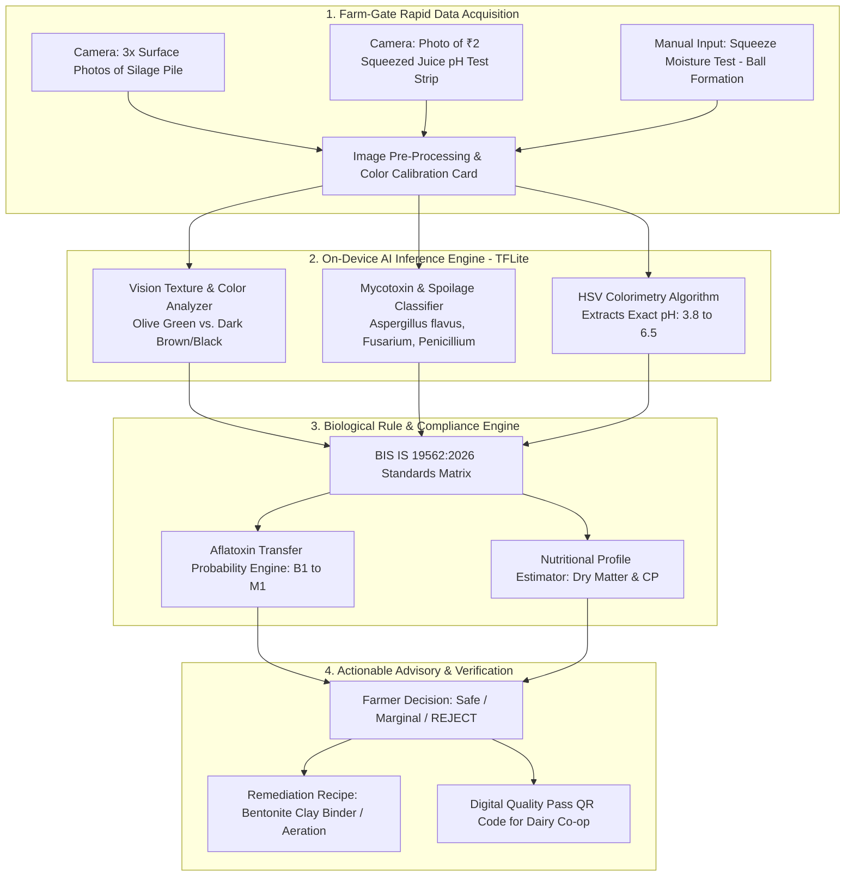

# 🌽 PS 26111: COMPREHENSIVE STRATEGIC BLUEPRINT
## "Smart AI-Enabled Rapid Feed and Silage Quality Testing System for Dairy Farmers"
**Sponsoring Agency:** Ministry of Fisheries, Animal Husbandry & Dairying (Department of Animal Husbandry & Dairying)  
**Theme:** Agriculture, FoodTech & Rural Development  
**Target Team Profile:** Bio / Biotech / Bioinformatics + Computer Science & Engineering (6 Members)  
**Document Type:** Team Discussion Blueprint & Hackathon Execution Roadmap  

---

## 📌 TABLE OF CONTENTS
1. [Executive Summary & Ground Reality](#1-executive-summary--ground-reality)
2. [The National Crisis: Feed-to-Milk Contamination Chain (2025–2026 Data)](#2-the-national-crisis-feed-to-milk-contamination-chain-20252026-data)
3. [The Fatal Flaw in Existing Systems (The Testing Gap)](#3-the-fatal-flaw-in-existing-systems-the-testing-gap)
4. [Why This PS Was Selected for a Bio + CSE Team](#4-why-this-ps-was-selected-for-a-bio--cse-team)
5. [Proposed Solution Architecture: "SiloCheck AI" (BoviNutri Engine)](#5-proposed-solution-architecture-silocheck-ai-bovinutri-engine)
6. [The 3 Unbeatable Moats (Your Unfair Advantages)](#6-the-3-unbeatable-moats-your-unfair-advantages)
7. [Feasibility, Operational Costs & Unit Economics](#7-feasibility-operational-costs--unit-economics)
8. [Judges' Defense Sheet: Grilling Q&A Preparedness](#8-judges-defense-sheet-grilling-qa-preparedness)
9. [36-Hour Hackathon Build Plan (Hour-by-Hour)](#9-36-hour-hackathon-build-plan-hour-by-hour)

---

## 1. Executive Summary & Ground Reality

India is the **world's largest producer of milk**, contributing over 24% of global dairy output. Over 80 million rural households depend directly on dairy farming for their livelihood. However, dairy profitability, cow fertility, and human food safety are secretly sabotaged by one primary factor: **untested, sub-standard, and contaminated cattle feed and fermented fodder (silage).**

### What is Silage?
During lean dry seasons when green pastures dry up, farmers chop green maize (corn) or sorghum and pack it tightly in underground pits or bunker silos without oxygen. Under proper anaerobic fermentation, beneficial **Lactic Acid Bacteria (LAB)** convert plant sugars into lactic acid, dropping the pH below 4.2. This pickled fodder (silage) preserves nutrients for up to 18 months.

### What Goes Wrong?
If packing is imperfect, air enters, or moisture levels exceed 70%:
1. Undesirable *Clostridium* and *Listeria* bacteria take over, producing noxious **butyric acid** instead of lactic acid.
2. Opportunistic molds (*Aspergillus flavus*, *Fusarium*, *Penicillium*) proliferate rapidly.
3. *Aspergillus* synthesizes **Aflatoxin $B_1$**—one of the most potent naturally occurring liver carcinogens known to science.
4. When cows ingest moldy silage, their liver metabolizes Aflatoxin $B_1$ into **Aflatoxin $M_1$**, which is **secreted directly into the cow's milk**.
5. Pasteurization or boiling milk at home **does not destroy aflatoxins** because they are heat-stable up to 250°C. Children and families consume carcinogenic milk daily without knowing it.

---

## 2. The National Crisis: Feed-to-Milk Contamination Chain (2025–2026 Data)

| Metric / Finding | Ground Truth & Data | Official Source |
|---|---|---|
| **Milk Testing Failure Rate** | **47.2% of raw and processed milk samples in northern states** (Punjab, Haryana) failed safety and quality standards. | FSSAI Enforcement Audits |
| **Aflatoxin M1 Prevalence** | Studies across major Indian dairy states found **over 35% of milk samples exceeded the statutory FSSAI limit of 0.5 µg/kg for Aflatoxin M1**. | ICAR-NDRI & Journal of Food Protection |
| **Economic Loss from Spoiled Feed** | Sub-acute acidosis and mycotoxin-induced mastitis cause a **15% to 30% permanent drop in daily milk yield** per lactating animal (~₹40,000 loss/cow/year). | National Dairy Development Board (NDDB) |
| **The New Regulatory Mandate (2026)** | Bureau of Indian Standards officially released **BIS IS 19562:2026**, prescribing stringent physical, chemical, and microbiological thresholds for commercial corn silage. | Bureau of Indian Standards (BIS Gazette) |
| **Adulteration in Commercial Concentrates** | Unscrupulous feed millers adulterate cattle feed with **synthetic urea** (to falsely inflate crude protein readings) and **industrial sand/silica** (to add bulk weight). | Consumer Affairs & Animal Husbandry Dept |

---

## 3. The Fatal Flaw in Existing Systems (The Testing Gap)

Why can't farmers currently test their feed and silage before feeding it to their cows?

```
┌────────────────────────────────────────────────────────────────────────────────────────┐
│                        THE STATUS QUO TESTING BOTTLENECK                               │
├────────────────────────────────┬───────────────────────────────────────────────────────┤
│ 1. Wet-Chemistry Testing       │ Takes 7 to 10 days to send samples to ICAR/NDDB labs. │
│                                │ By the time results arrive, the batch is already fed! │
├────────────────────────────────┼───────────────────────────────────────────────────────┤
│ 2. Cost Prohibitive            │ A single comprehensive lab test costs ₹1,500–₹3,500.  │
│                                │ A farmer with 4 cows cannot afford this monthly.     │
├────────────────────────────────┼───────────────────────────────────────────────────────┤
│ 3. Commercial NIR Spectrometers│ Handheld near-infrared devices (trinamiX, FOSS) cost  │
│                                │ ₹8 Lakh to ₹20 Lakh. Completely out of rural reach.  │
└────────────────────────────────┴───────────────────────────────────────────────────────┘
```

**The Missing Solution:** A tool that costs **₹0 to ₹5 per test**, delivers actionable safety grades in **under 60 seconds**, runs on a standard smartphone, works **100% offline in rural barn sheds**, and aligns directly with **BIS IS 19562:2026**.

---

## 4. Why This PS Was Selected for a Bio + CSE Team

This problem is a dream project for a multi-disciplinary team because **pure CSE teams do not understand fermentation biochemistry**, while **pure Bio teams cannot build edge computer-vision models**.

```
              ┌───────────────────────────────────────────────────────────┐
              │             THE BIO + CSE WINNING SYNERGY                 │
              └───────────────────────────────────────────────────────────┘
                                           │
         ┌─────────────────────────────────┴─────────────────────────────────┐
         ▼                                                                   ▼
┌─────────────────────────────────┐                         ┌─────────────────────────────────┐
│       BIOLOGY / BIOTECH         │                         │         COMPUTER SCIENCE        │
├─────────────────────────────────┤                         ├─────────────────────────────────┤
│ • Silage Fermentation Chemistry │                         │ • Edge Computer Vision (TFLite) │
│   (Lactic vs. Butyric acid)     │                         │   Texture, Mold, Colorimetry    │
│ • Aflatoxin B1 → M1 Metabolic   │                         │ • Color-Calibrated pH Strip     │
│   Transfer Ratio (Bio-kinetics) │                         │   Computer Vision Reader (HSV)  │
│ • BIS IS 19562:2026 Parameter   │                         │ • Offline PWA / Android APK     │
│   Threshold Rules               │                         │   (Runs with zero internet)     │
│ • Ration Rebalancing Formulations│                        │ • Dairy Cooperative Fleet Cloud │
│   (Toxin binders, yeast culture)│                         │   Dashboard & Batch QR Passes   │
└────────────────────────────────┘                         └─────────────────────────────────┘
```

---

## 5. Proposed Solution Architecture: "SiloCheck AI" (BoviNutri Engine)

"SiloCheck AI" combines **smartphone macro-photography** with an ultra-low-cost **chemical proxy (₹2 colorimetric strip)** to grade feed without expensive hardware.



### How the Step-by-Step User Flow Works:
1. **Visual Crop Assessment:** The farmer snaps 3 clear photos of the opened silage pit face or cattle feed concentrate bag alongside a standardized reference color card (or white paper).
2. **Vision AI Feature Extraction:**
   * **Fermentation Color Scoring:** Quantifies RGB/Lab color ratios. Healthy lactic silage is light greenish-yellow or olive. Dark brown/black indicates overheated caramelization (Maillard reaction), destroying protein bioavailability.
   * **Mold Patch Segmentation:** Identifies white cottony mycelium (*Mucor*), blue-green powdery mold (*Aspergillus* / *Penicillium*), or pinkish patches (*Fusarium*).
3. **The ₹2 Rapid pH Strip Reader:**
   * The farmer squeezes a handful of silage to extract a few drops of liquid onto a ₹2 universal pH strip.
   * The app's computer vision algorithm samples the strip against an on-screen color calibration scale, determining pH with ±0.15 accuracy:
     * $\text{pH } < 4.2$: Excellent anaerobic preservation.
     * $\text{pH } 4.2 - 4.8$: Marginal; aerobic exposure occurring.
     * $\text{pH } > 5.0$: **CRITICAL FAILURE.** Clostridial spoilage producing high butyric acid and ammonia.
4. **BIS IS 19562:2026 Grading:** The system compares visual metrics, pH, and tactile moisture against the BIS threshold matrix:
   * **Grade 1 (Premium):** Highly nutritious, safe for high-yielding crossbred cows.
   * **Grade 2 (Standard):** Acceptable for maintenance; needs aeration before feeding.
   * **REJECT (Hazardous):** Prohibits feeding; high probability of lethal Aflatoxin contamination.

---

## 6. The 3 Unbeatable Moats (Your Unfair Advantages)

### 🛡️ Moat 1: Native BIS IS 19562:2026 Compliance Engine
* Other hackathon apps present generic "good/bad" percentages.
* Your app generates an **official digital certificate citing BIS IS 19562:2026 Clauses**, specifying:
  * Dry Matter (DM) estimation: 30–35%
  * pH cutoff compliance: $< 4.2$
  * Visual Spoilage Index: $< 2\%$ surface area
  * Flory's Silage Quality Score (FSQS) calculation.

### 🛡️ Moat 2: Feed-to-Milk Aflatoxin $M_1$ Projected Toxicity Model
* **The Biology Moat:** Pure CSE teams cannot answer: *"So what if the feed has 20 ppb Aflatoxin?"*
* **Your Answer:** Bio students calculate the biological carry-over rate:
  $$\text{Aflatoxin } M_1 \text{ in Milk (µg/L)} = \text{Aflatoxin } B_1 \text{ Intake (µg/day)} \times 0.015 \text{ (1.5% Carryover Factor)}$$
* The app explicitly warns: *"Feeding this batch will cause your cow's milk to exceed the statutory FSSAI limit of 0.5 µg/kg within 48 hours, causing bulk rejection at the collection center."*

### 🛡️ Moat 3: 100% Zero-Hardware, Zero-Internet Edge Deployment
* While competitors propose expensive IoT probes, spectroscopic sensors, or cloud APIs that fail in rural sheds:
* Your solution uses **the farmer's existing Android phone + ₹2 paper strip**. All vision models run on-device via quantized **TensorFlow Lite (TFLite)**.

---

## 7. Feasibility, Operational Costs & Unit Economics

When judges challenge your operational model, present this concrete breakdown:

### Unit Cost Comparison:
| Parameter | Conventional ICAR Lab Testing | Commercial NIR Spectrometer | "SiloCheck AI" (Our Solution) |
|---|---|---|---|
| **Capital Equipment Cost** | Lab equipment (₹25–50 Lakh) | Handheld NIR (₹12 Lakh) | **₹0 (Farmer's existing phone)** |
| **Recurring Cost per Test** | ₹1,500 – ₹3,500 | ₹50 per calibration scan | **₹2 (Optional pH test strip)** |
| **Turnaround Time** | 7 to 10 Days | 2 Minutes | **Under 45 Seconds** |
| **Accessibility** | District HQ / State Lab | Dairy Union HQ only | **Directly in farmer's cattle shed** |

### Business & Sustainability Model:
* **Target Buyer:** Dairy Cooperatives (Amul, Nandini, Mahanand, Mother Dairy) and private feed mills.
* **Incentive:** Cooperatives subsidize or distribute the app to their village Village Level Milk Collection Centers (VLMCC). Detecting bad feed at the farm gate prevents contamination of a 10,000-litre bulk milk cooling tanker!

---

## 8. Judges' Defense Sheet: Grilling Q&A Preparedness

### Q1: "How can a smartphone camera measure crude protein or chemical toxins without NIR spectroscopy?"
> **Our Answer:** *"We are completely honest: a smartphone RGB camera is not a laboratory mass-spectrometer. However, in agricultural biochemistry, **physical fermentation quality strongly correlates with biochemical safety.** In corn silage, pH is the universal biochemical proxy for fermentation success; mold patch morphology identifies toxigenic fungal species; and dark caramelization indicates Maillard browning which binds and destroys crude protein. We provide **rapid field screening and risk triage**. If our app flags a batch as High Risk, only then is a laboratory chemical assay required, saving 95% of unnecessary testing costs."*

### Q2: "Lighting in cattle sheds varies widely. Won't shadows and yellow bulbs break your color analysis?"
> **Our Answer:** *"We solve lighting variation using an active **White-Balance & Color-Constancy Calibration Algorithm**. The farmer captures the feed alongside a standard reference color strip (or a clean white piece of paper). Our computer vision pre-processing pipeline computes the von Kries chromatic adaptation transform, normalizing lighting variations before feeding the image into our segmentation neural network."*

### Q3: "What about chemical adulterants like synthetic urea in packaged cattle feed?"
> **Our Answer:** *"For commercial feed concentrate bags, our app integrates a simple colorimetric 10-second spot test: the farmer adds 1 drop of water and a pinch of soybean meal (containing urease enzyme) onto a spot-plate with a bromothymol blue indicator. If synthetic urea is present, urease hydrolyzes it into ammonia within 60 seconds, turning the indicator deep blue. The smartphone camera scans and verifies the color change automatically."*

### Q4: "Why hasn't NDDB or the government already built this?"
> **Our Answer:** *"NDDB launched apps like Pashu Poshan, but they are **ration formulation calculators**, not diagnostic testing tools. Silage standards in India were only formalized in **May 2026 under BIS IS 19562:2026**. The government literally just created the legal benchmark, and our software is the first operational enforcement mechanism built specifically for it."*

---

## 9. 36-Hour Hackathon Build Plan (Hour-by-Hour)

```
┌───────────────────┬────────────────────────────────────────────────────────────────────────┐
│ TIMELINE          │ MILESTONES & TEAM DELIVERABLES                                         │
├───────────────────┼────────────────────────────────────────────────────────────────────────┤
│ Hours 00 – 06     │ • Freeze UI flow and offline PWA schema.                               │
│ (Data & Specs)    │ • Bio team digitizes BIS IS 19562:2026 clauses into JSON rule logic.   │
│                   │ • Compile and augment image datasets (maize silage, mold classes).     │
├───────────────────┼────────────────────────────────────────────────────────────────────────┤
│ Hours 06 – 16     │ • Train/Quantize TFLite classification model (Mold vs. Healthy Silage).│
│ (CV & Logic)      │ • Develop HSV colorimetry algorithm for automated pH test strip reading│
│                   │ • Connect Bio Flory score formula to vision outputs.                   │
├───────────────────┼────────────────────────────────────────────────────────────────────────┤
│ Hours 16 – 24     │ • Build mobile frontend with real-time camera viewfinder & guides.     │
│ (Mentoring R1-R2) │ • Implement offline local storage (IndexedDB) for test histories.      │
│                   │ • Demo live pH strip reading to Mentors; incorporate feedback.         │
├───────────────────┼────────────────────────────────────────────────────────────────────────┤
│ Hours 24 – 32     │ • Build Dairy Cooperative Cloud Dashboard (Procurement zone map).      │
│ (Co-op & Polish)  │ • Implement QR Code generation for certified compliant feed batches.   │
│                   │ • Multilingual voice advisory in Marathi & Hindi for farmers.          │
├───────────────────┼────────────────────────────────────────────────────────────────────────┤
│ Hours 32 – 36     │ • Rehearse live demonstration using real silage/feed samples & strips. │
│ (Pitch Rehearsal) │ • Polish 6-slide deck emphasizing BIS 2026 standard and milk safety.   │
└───────────────────┴────────────────────────────────────────────────────────────────────────┘
```

---
*Created for team review and strategic planning. Ready for implementation.*
