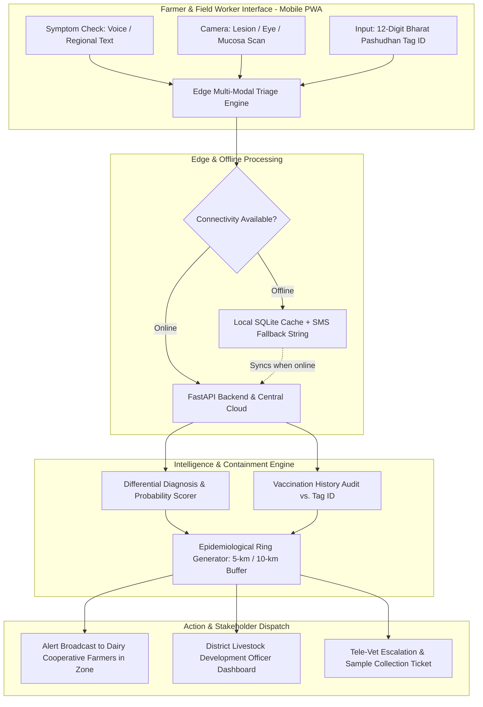

# 🐾 PS 26128: COMPREHENSIVE STRATEGIC BLUEPRINT
## "Efficient Systems for Early Detection, Prevention, and Management of Livestock Diseases and Animal Health Issues"
**Sponsoring Agency:** Government of Maharashtra (Maharashtra State Innovation Society)  
**Theme:** Agriculture, FoodTech & Rural Development  
**Target Team Profile:** Bio / Biotech / Bioinformatics + Computer Science & Engineering (6 Members)  
**Document Type:** Team Discussion Blueprint & Hackathon Execution Roadmap  

---

## 📌 TABLE OF CONTENTS
1. [Executive Summary & Ground Reality](#1-executive-summary--ground-reality)
2. [The Real-World Crisis (2025–2026 Data)](#2-the-real-world-crisis-20252026-data)
3. [The Fatal Flaw in Existing Solutions (The True Market Gap)](#3-the-fatal-flaw-in-existing-solutions-the-true-market-gap)
4. [Why This PS Was Selected for a Bio + CSE Team](#4-why-this-ps-was-selected-for-a-bio--cse-team)
5. [Proposed Solution Architecture: "PashuRaksha AI"](#5-proposed-solution-architecture-pashuraksha-ai)
6. [The 3 Unbeatable Moats (Your Unfair Advantages)](#6-the-3-unbeatable-moats-your-unfair-advantages)
7. [Feasibility, Operational Costs & Unit Economics](#7-feasibility-operational-costs--unit-economics)
8. [Judges' Defense Sheet: Grilling Q&A Preparedness](#8-judges-defense-sheet-grilling-qa-preparedness)
9. [36-Hour Hackathon Build Plan (Hour-by-Hour)](#9-36-hour-hackathon-build-plan-hour-by-hour)

---

## 1. Executive Summary & Ground Reality

In rural India, a dairy cow or buffalo is not just farm livestock—it is a family's primary financial safety net, worth **₹60,000 to ₹1,20,000**, providing daily cash flow through milk sales. When an infectious outbreak like **Lumpy Skin Disease (LSD)**, **Foot-and-Mouth Disease (FMD)**, or **Bovine Mastitis** strikes a village:
1. The farmer notices symptoms (fever, salivation, nodules) but waits 3–5 days hoping it passes, or consults an unqualified local quack.
2. By the time a certified government field veterinarian is alerted, the pathogen has spread via aerosols, flies, or shared grazing grounds to **30+ neighbouring farms**.
3. Diagnostic laboratories are located at the district headquarters (50–100 km away); sample collection takes days, while mortality rises and milk production plummets to zero.
4. **Zoonotic spillover risk** (diseases jumping from animals to humans, such as Brucellosis and Anthrax) remains unmonitored.

The Government of Maharashtra specifically framed **PS 26128** to bridge this fatal lag between **first symptom observation at the village shed** and **coordinated state-level epidemiological containment**.

---

## 2. The Real-World Crisis (2025–2026 Data)

| Metric / Event | Verified Data & Impact | Government Reference |
|---|---|---|
| **Lumpy Skin Disease (LSD) Resurgence** | Active localized outbreaks reported in Maharashtra, HP, and UP in 2025–2026. Over 1.5 lakh cattle deaths nationwide across cycles. | Ministry of Fisheries, Animal Husbandry & Dairying (DAHD) |
| **Foot & Mouth Disease (FMD) Hotspots** | Outbreaks in eastern & western belts; direct milk yield reduction of 40–80% in affected animals. | National Animal Disease Control Programme (NADCP) |
| **National Budget Commitment** | **₹13,343 Crore** allocated for NADCP to eliminate FMD and Brucellosis by 2030. | Cabinet Committee on Economic Affairs (CCEA) |
| **Economic Loss per Incident** | Average loss of **₹45,000–₹80,000 per dairy household** due to animal mortality, aborted pregnancies, and treatment costs. | Indian Council of Agricultural Research (ICAR-NIVEDI) |
| **Veterinary Doctor Shortage** | Only **1 government veterinarian per 7,000–10,000 livestock units** in rural blocks (vs. recommended 1 per 5,000). | Parliamentary Standing Committee on Agriculture |

---

## 3. The Fatal Flaw in Existing Solutions (The True Market Gap)

If you tell an SIH judge: *"We are building an AI app that classifies cow skin diseases from a camera photo,"* **you will lose.** Why? Because several startups and projects already do simple image classification (e.g., *Gau Swastha*, *Pashu Robot*, research CNN models).

### What Existing Apps Miss (The Real Gaps):
1. **The Isolated Photo Trap:** A photo alone cannot diagnose internal systemic diseases like Anthrax, Hemorrhagic Septicemia (HS), or early Mastitis where external lesions are invisible.
2. **Zero Outbreak Containment:** Existing apps tell the individual farmer *"Your cow has suspected LSD"*, but **fail to calculate a geographical quarantine perimeter** to protect surrounding farms.
3. **Disconnected from National Databases:** India already has **Bharat Pashudhan**, which gives animals a **12-digit UID eartag**. Existing AI apps operate in a silo without checking the animal's prior vaccination history recorded on the national portal.
4. **The "Rural 2G / No-Internet" Blindspot:** Most farmer sheds have poor connectivity; cloud-only API apps crash or freeze.

---

## 4. Why This PS Was Selected for a Bio + CSE Team

This problem statement sits squarely at the intersection of **Veterinary Pathology / Epidemiology** and **Distributed Systems / GIS Machine Learning**.

```
              ┌───────────────────────────────────────────────────────────┐
              │             THE WINNING SYNERGY (BIO + CSE)               │
              └───────────────────────────────────────────────────────────┘
                                           │
         ┌─────────────────────────────────┴─────────────────────────────────┐
         ▼                                                                   ▼
┌─────────────────────────────────┐                         ┌─────────────────────────────────┐
│       BIOLOGY / BIOTECH         │                         │         COMPUTER SCIENCE        │
├─────────────────────────────────┤                         ├─────────────────────────────────┤
│ • Differential Symptom Matrix   │                         │ • Edge Vision Inference         │
│   (FMD vs. Vesicular Stomatitis)│                         │   (Offline TFLite / ONNX)       │
│ • Epidemiological R0 & Vector   │                         │ • Geospatial GIS Mapping        │
│   Transmission Dynamics (Aerosol│                         │   (Dynamic Geo-Fencing Buffers) │
│   vs. Arthropod Stomoxys fly)   │                         │ • Bharat Pashudhan API Sync &   │
│ • Zoonotic Pathogen Risk Level  │                         │   SMS-Fallback Architecture     │
│ • Clinical Triage Decision Tree │                         │ • Role-Based Web & Mobile Admin │
│   (Emergency vs. Sub-acute)     │                         │   Command Dashboard             │
└─────────────────────────────────┘                         └─────────────────────────────────┘
```

* **When the Judge grills on Medicine:** The Biology students explain incubation periods, vesicle rupture pathology, secondary bacterial infections, and why a 5-km buffer is mandatory for aerosol transmission.
* **When the Judge grills on Tech:** The CSE students explain spatial indexing (Uber H3 / PostGIS), quantized edge models, low-bandwidth delta synchronization, and unit server costs.

---

## 5. Proposed Solution Architecture: "PashuRaksha AI"

"PashuRaksha AI" is an end-to-end **Epidemiological Surveillance, Triage & Ring Containment Platform** engineered for rural field conditions.



### End-to-End User Flow:
1. **Field Reporting:** The farmer or village Pashu Sakhi (field worker) inputs symptoms in Marathi/Hindi via voice or checklist + snaps a photo of visible lesions (skin, mouth, hoof).
2. **Bharat Pashudhan Audit:** Enters the 12-digit ear tag UID. The system checks: *"Was this cow vaccinated against FMD in the last 6 months?"* If NOT, the disease probability score jumps by +35%.
3. **Multi-Modal Triage:** Combines visual classification (YOLOv8-nano / MobileNetV3) with a rule-based clinical diagnostic tree.
4. **Geo-Fenced Outbreak Ring Activation:** If a contagious disease (LSD/FMD/HS) is flagged above 80% confidence, the system dynamically generates:
   * **Infected Zone (0–3 km):** Immediate animal movement stoppage advisory.
   * **Surveillance Buffer (3–10 km):** Ring-vaccination advisory to all registered dairy farmers within the radius.
5. **Administrative Action Ticket:** Automated escalation to the Taluka Veterinary Dispensary with GPS coordinates for rapid sample collection.

---

## 6. The 3 Unbeatable Moats (Your Unfair Advantages)

### 🛡️ Moat 1: Dynamic Epidemiological Ring Containment (Not Just an App, a Quarantine Protocol)
* **What Others Do:** Show a generic alert: *"Consult a vet."*
* **What We Do:** Implement actual ICAR/OIE quarantine protocols. Different pathogens have different transmission vectors:
  * **FMD (Aerosol transmission):** Generates a **10-km windward buffer**.
  * **LSD (Vector-borne via biting flies/ticks):** Generates a **5-km buffer** with an advisory to spray anti-tick cypermethrin in cattle sheds.
  * **Mastitis (Contaminated milking machine):** Confined to herd-level biosecurity; no geographic ring needed.

### 🛡️ Moat 2: Bharat Pashudhan Tag ID Cross-Referencing
* Leverages the Indian government's existing 12-digit animal UID system.
* By cross-referencing symptom alerts with national vaccination registries, the system spots **"Vaccination Failure Clusters"** (e.g., if vaccinated cows in a specific village get sick, it flags cold-chain vaccine spoilage to district officers).

### 🛡️ Moat 3: True Dual-Engine Offline Resilience (PWA + SMS-Gram)
* Works in 100% offline environments via browser IndexedDB and WebAssembly.
* If a critical outbreak is suspected without 4G/5G, the app encodes the triage summary into a **compressed 140-character SMS format** (e.g., `PR#LSD#92%#TAG849201948201#LAT19.75#LNG75.71`) sent to a toll-free government gateway (1962).

---

## 7. Feasibility, Operational Costs & Unit Economics

Judges frequently interrogate hackathon teams on **scalability and infrastructure costs**. Here is your exact economic defense:

### Infrastructure & Operational Economics Table:
| Component | Technology Choice | Monthly Cost (Pilot: 1 District / ~50,000 Cattle) | Cost at Scale (Full State: ~2 Crore Livestock) |
|---|---|---|---|
| **AI Inference** | On-Device TFLite (Client-side CPU/NPU) | **₹0.00** (Runs on farmer's smartphone) | **₹0.00** (Zero server GPU load) |
| **Backend API** | FastAPI running on Docker / AWS ECS Fargate | ₹2,500 / month | ₹45,000 / month |
| **Database & GIS** | PostgreSQL + PostGIS (Spatial indexing) | ₹3,000 / month (RDS managed) | ₹35,000 / month |
| **SMS Gateway** | Government C-DAC / NIC Mobile Seva (e-Gov quota) | Free / Nominal ₹0.05 per SMS alert | Covered under State Disaster / DAHD budget |
| **Total Operational Cost** | — | **~₹5,500 / month** | **~₹80,000 / month** |

### Unit Cost per Animal Monitored:
$$\text{Cost per Animal per Year} = \frac{\text{Annual State Infra Cost (₹9.6 Lakh)}}{\text{Livestock Population (2 Crore)}} = \mathbf{₹0.048 \text{ per animal/year}}$$
*Compare this with commercial IoT animal collars that cost **₹20,000 per animal**!*

---

## 8. Judges' Defense Sheet: Grilling Q&A Preparedness

### Q1: "Farmers in villages are not tech-savvy. How will they use your app?"
> **Our Answer:** *"We designed for zero-literacy usability: 100% voice interaction in Marathi and Hindi via open-source Bhashini STT, combined with single-tap visual symptom pictograms. Furthermore, in Maharashtra, every village has trained 'Pashu Sakhis' (rural livestock community workers) under the National Rural Livelihood Mission who already use smartphones to record data. They act as the primary operators."*

### Q2: "A phone camera cannot replace a pathologist. How do you prevent false diagnosis?"
> **Our Answer:** *"PashuRaksha is explicitly a **triage and surveillance tool, not a diagnostic dispensary.** We classify cases into: Green (Routine/Home Care), Yellow (Requires Para-Vet visit within 24h), and Red (Contagious Outbreak Emergency). We never prescribe restricted schedule drugs; we prescribe supportive first aid, trigger quarantine rings, and generate a laboratory sample collection requisition ticket for certified veterinary officers."*

### Q3: "What if someone uploads a picture of a dog or a random animal?"
> **Our Answer:** *"Our vision pipeline uses a two-stage gatekeeper: Stage 1 is an on-device YOLOv8 animal species validator that checks if the subject is bovine (cow/buffalo) and identifies the anatomical region (udder, muzzle, skin). If an invalid image is uploaded, it is rejected immediately before running the pathology model."*

### Q4: "How does the Government of Maharashtra fund and maintain this?"
> **Our Answer:** *"The operational expenditure directly maps to the existing **NADCP (National Animal Disease Control Programme)** administrative budget line, which has dedicated provisions for digital disease surveillance and cold-chain monitoring. It integrates as a value-added layer on top of Maharashtra's existing 1962 Veterinary Helpline and Bharat Pashudhan infrastructure."*

---

## 9. 36-Hour Hackathon Build Plan (Hour-by-Hour)

```
┌───────────────────┬────────────────────────────────────────────────────────────────────────┐
│ TIMELINE          │ MILESTONES & TEAM DELIVERABLES                                         │
├───────────────────┼────────────────────────────────────────────────────────────────────────┤
│ Hours 00 – 06     │ • Freeze API contracts between frontend and backend.                   │
│ (Setup & DB)      │ • Setup PostgreSQL + PostGIS with Maharashtra administrative geo-json. │
│                   │ • Bio team finalizes the 15-disease symptom matrix & triage scores.    │
├───────────────────┼────────────────────────────────────────────────────────────────────────┤
│ Hours 06 – 16     │ • Train/Quantize MobileNetV3/YOLOv8 on LSD/FMD lesion datasets.        │
│ (Core Build)      │ • Build FastAPI endpoints for symptom ingestion and tag validation.    │
│                   │ • Implement dynamic circle/polygon geo-fencing in PostGIS.             │
├───────────────────┼────────────────────────────────────────────────────────────────────────┤
│ Hours 16 – 24     │ • Integrate Leaflet/Mapbox map displaying live outbreak rings.         │
│ (Mentoring R1-R2) │ • Implement Marathi voice input (Bhashini/Web Speech API).             │
│                   │ • Present working triage to Mentors; capture feedback on 2G offline.  │
├───────────────────┼────────────────────────────────────────────────────────────────────────┤
│ Hours 24 – 32     │ • Build Offline PWA IndexedDB cache and SMS fallback string generator.│
│ (Feature Polish)  │ • District Officer dashboard with heatmaps and quarantine alerts.      │
│                   │ • Bio team creates simulated outbreak scenario for live demonstration. │
├───────────────────┼────────────────────────────────────────────────────────────────────────┤
│ Hours 32 – 36     │ • End-to-end rehearsal with airplane mode toggling during demo.       │
│ (Pitch Rehearsal) │ • Finalize 6-Slide presentation deck highlighting unit economics.     │
└───────────────────┴────────────────────────────────────────────────────────────────────────┘
```

---
*Created for team review and strategic planning. Ready for implementation.*
